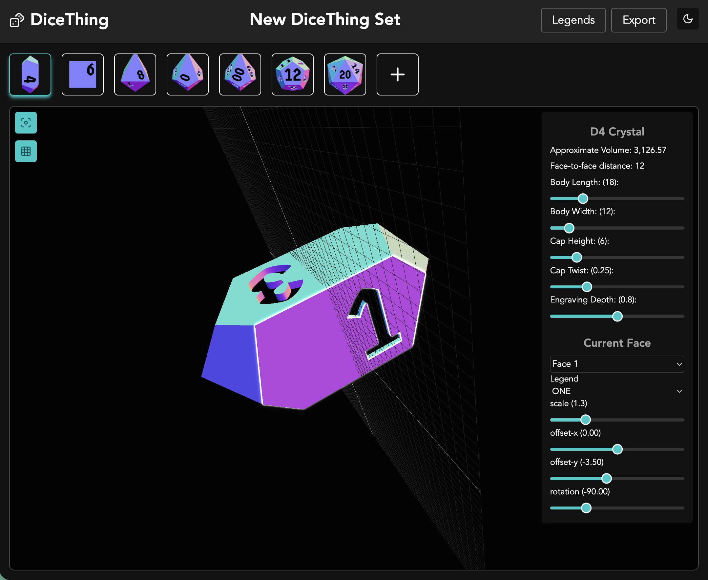

# DiceThing

**This is a work in progress.**

DiceThing is a tools for creating custom dice models suitable for printing.

It is highly inspired by [DiceMaker](https://ankhe.itch.io/dicemaker) which is a fantastic tool, but not open source, so we cannot build on it and make improvements or add features.

Half-way through building this I found [DiceGen](https://dicegen.com/) which is also similar but opinionated in different ways. I haven't looked through the code for that one much (it is open source :heart:) and I think the font-handling is superior. I wonder if I can use a full CSG style approach to improve the pipeline of `font -> paths -> outline`, as currently fonts with paths that self-intersect cause rendering issues (see Josefine Sans character 3)

This project also aims to be completely web-based, for a zero-install experience. Web technologies are quite capable of handling the 3D modelling required for this.

## Screenshot



## Features

- Many dice shapes available, and customisable
- Custom legends
  - Can be created from fonts, or SVGs
- A few font based legends included (fonts all free for commercial use)
- Legend placement on faces (scale/rotate/position/engraving depth)
- Save / Load dice sets
- Save sets in JSON with all data needed to recreate in another browser.
- Export sets or individual dice as STLs
- Blank generation alongside each die
- Platform generation alongside each die

I have some other features in mind that I might add (Z-Stretch compensation, Auto-Supporting, Bumpers), but those will be later.

## Getting Started

This is a SvelteKit project and I use Bun as the runtime but others may work.

The only unusual thing is that I share most of the code with 2 `routes/` folders. The reason is that I wanted a "splash page" as well as the app, but I want them to share theme/components/logic/$lib/ ... and making it a monorepo was too much.

So instead I have 2 routes folders `routes/splash` and `routes/app` and the sveltekit config is changed dynamically depending on the presence of the `BUILD_SPASH_PAGE=true` environment variable. But we have `bun run dev:app` and `bun run dev:splash` to control that (as well as `bun run build:app` and `bun run build:splash`). They also build to 2 separate static folders that can be deployed wherever you want.

For my instance that means `https://dicething.org/` and `https://app.dicething.org/`

Basics:

```
bun install
bun run dev
```

A full static build can be produced with:

```
bun run build:app # or build:splash
```

## Notes

I originally started this with three.js and a CSG library. But the renders were slow and the resultant STL files were broken in subtle ways.
In the end, I wrote a custom engraving algorithm that works in 2D and then wires up the engravings to form a 3D model. This is much faster and produces better results.

However there are still problems with the exported STLs, and I have discovered that this is almost always due to the fonts. The font conversion to paths is not always "clean", and sometimes paths overlap. This doesn't cause a rendering problem on screen, but the meshes get complicated and sometime appear non-manifold. Careful handling of the fonts before legend creation helps. This will likely need more work in the future.

Finally, it would be nice to have all the geometry and rendering done off-screen, with an offscreen canvas in a worker. That way even the 10's of ms it takes to render won't block anything.

## Checklist

### Technical

This is the list of the things I have implemented the code for, but not necessarily created the UI for.
The UI section will need a whole lot more...

- [ ] Parameterised Dice Shapes
  - [x] Classic 7 (caltrop d4, cube d6, octahderon d8, trapezohedron d10/d%, dodecahedron d12, icosahedron d20)
  - [x] Crystals (d4, d6, d8, d10/d%, d12)
  - [x] Rhombics (d6, d12)
  - [x] Shards (d4,d6, d8, d10/d%, d12)
  - [x] Barrels (d4,d6, d8, d10/d%, d12)
  - [ ] Caltrop D4 (as 12 faces both on tips and edges, and with only 4 faces)
    - [x] With 12 faces on tips
    - [ ] With 12 faces on edges
    - [ ] With 4 faces (for custom stuff)
    - [ ] Truncated? i.e. legends on tips?
  - [ ] Coin D2 - a short cylinder
    - [ ] Regular Polygon
    - [ ] Circle (I probably have to keep these separate)
- [x] Legend Engraving
  - [x] auto-fit legends by default
    - [ ] auto custom scale per-face-per-legend (i.e. a D20 wants numbers as large as possible on each face, not consistent on each face) - maybe an "oncreate" option?
  - [x] customisable scale/rotation/translation
  - [x] per-face engraving depth
  - [x] per-face legend override
- [ ] Rendering
  - [x] basic scene render and materials
  - [x] customisable materials for faces/engravings
  - [x] per-face render cache with invalidation
  - [ ] offscreen canvas rendering
    - [x] in worker for preview images
    - [ ] for main scene (might be more trouble than it's worth at the moment, need to test on slower machines...)
  - [x] STL output and geometry preprocessing
  - [x] Bad manifold detection and edge fixing (not 100%, some errors don't cause problems, but it is a warning)
  - [ ] multiple dice scene for rendering full sets.
  - [x] mouse pointer integration (for click detection/handling)
- [ ] Blanks / Platformms
  - [ ] generate a die with blanks at a given "inset" from the source parameters
  - [ ] generate platforms automatically from the number faces (custom face shape needed for caltrop)
  - [ ] make blank/platform generation configurable.
  - [ ] how to make the output accessible to the renderer
- [ ] Save / Load JSON
  - [x] create a serialisation format (JSON, but a schema)
  - [ ] save
  - [x] load
  - [x] identify whether use of (say) indexedDB would be a good fit for our data
    - [x] localStorage is fine
- [ ] Legend Creation
  - [x] Load fonts from TTF
  - [x] proprocess font shapes for easily fixable issues
  - [x] create a save/load-able LegendSet from a font and a set of strings to use for each legend
  - [x] find and create legends sets for a few fonts so we have some in-builtin options
  - [ ] Add (simple) SVG i.e just paths with fill, not strokes.
  - [ ] Add "symbol from font by text" with letter spacing
  - [ ] Add "line under symbol" for 6/9 marked symbols - hopefully without breaking the centering?
  - [ ] Add "lucide" icons as legends - potrace? or from font lucide is available as a font...
  - [ ] Add custom legend from image. that needs potrace working on a canvas. possibly with some knobs to turn...
        Maybe a disclaimer that for best results provide an SVG pre-converted from "stoke to path" with inkscape instructions.
        In fact maybe ONLY allow that...

### User Interface

This is the final piece that makes all this usable.
I'd like to keep it account-free, and "offline" if possible, but the first step will be "local-first", i.e. whatever data is in your browser.

The first flow will be

1. "new set" button
2. pick dice shapes
3. overview of current dice
4. pick one to edit
5. single die editor
   - live preview
   - all parameters tweakable
   - options for each face
   - single die export (with or without blanks/platforms)
6. back to overview
7. add/remove die shapes
8. save set
9. load new / start new
10. export all as set.

- [x] new set from preset
- [x] load saved set
- [ ] import JSON
- [ ] set view
  - [x] previews of die
  - [x] main selected die view
  - [x] edit singel die parameters
  - [ ] close die parameter draw (for space)
  - [ ] save changes!
  - [ ] title edit
  - [ ] legend editor (component)
    - [ ] font loader - character set picker
  - [ ] legend picker (component) - i.e. pick a symbol from the current set - a select box alike
  - [ ] set menu
    - [ ] combine legends/export/lightswitch into a single menu
    - [ ] export options (component)
      - [ ] toSTL options i.e. auto blanks
      - [ ] toJSON ? are there options?

### Fonts

Most issues come from font problems when converted to SVG paths for engraving.

> Example: Josefin Sans Medium character 3 has 2 instances of paths overlapping. This is a big problem, and one I would like to solve.

## Notes

I quite want to animate the explode feature....
I guess the I shouldn't translate the geometry of the faces, but rather the meshes themselves...
Then I can animate/orient the meshes separately from the builder.
