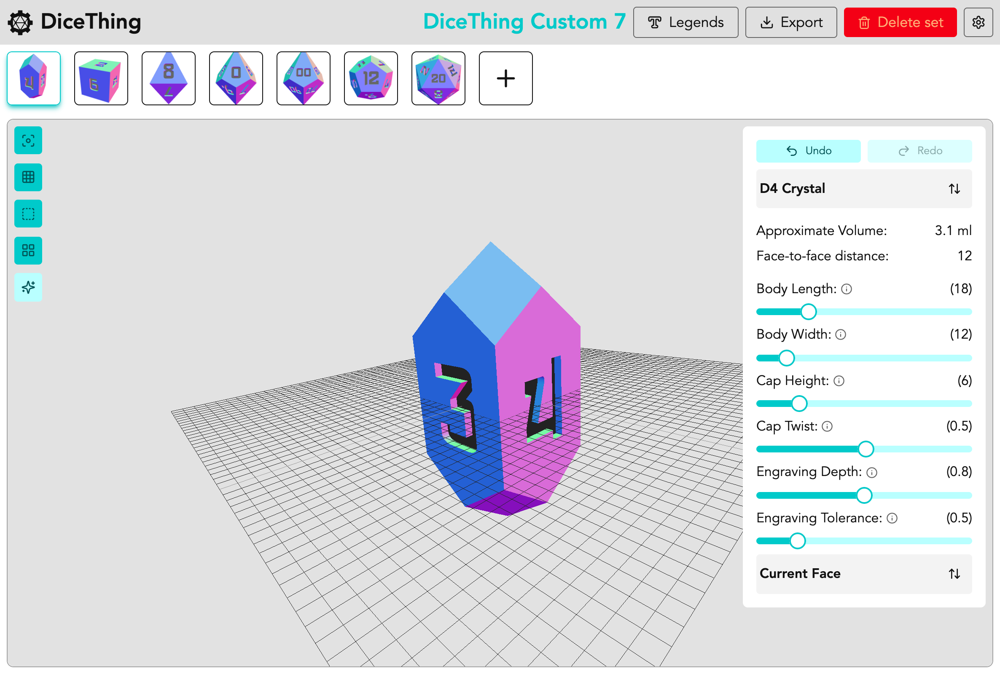
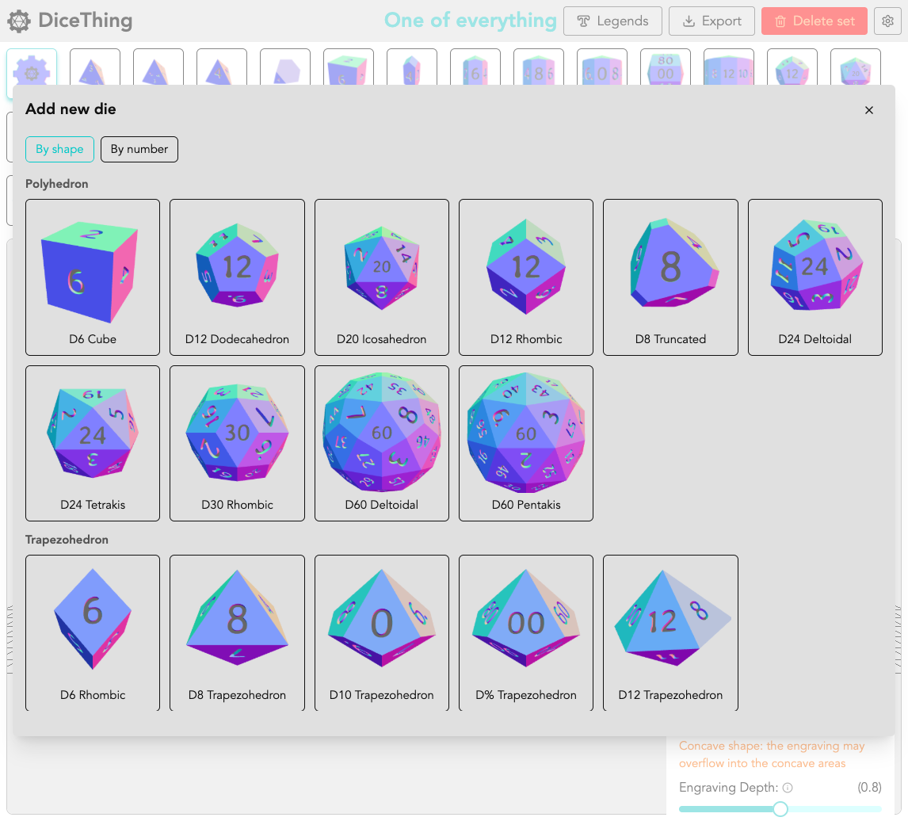
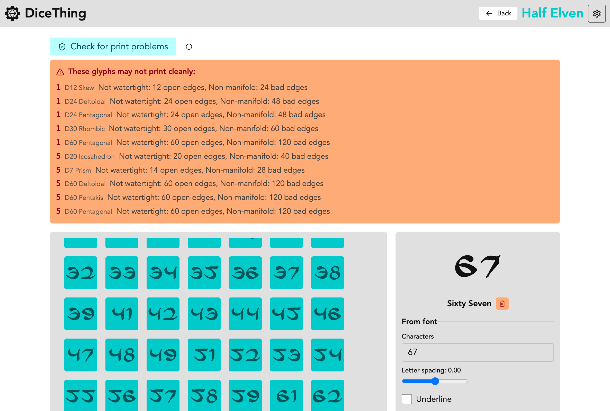
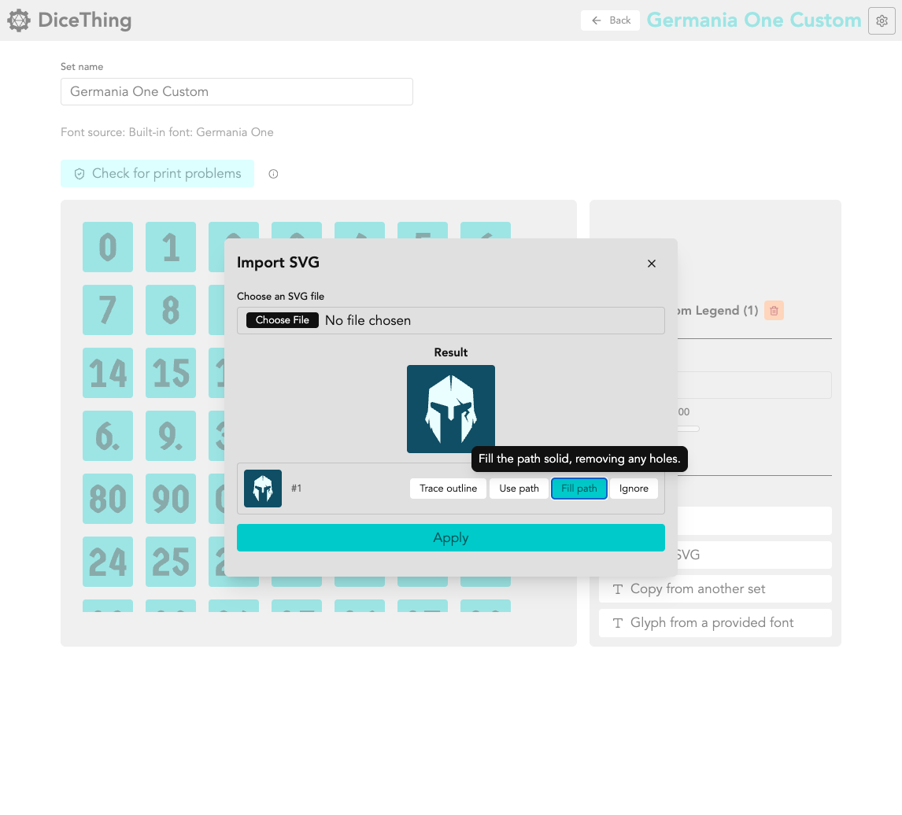
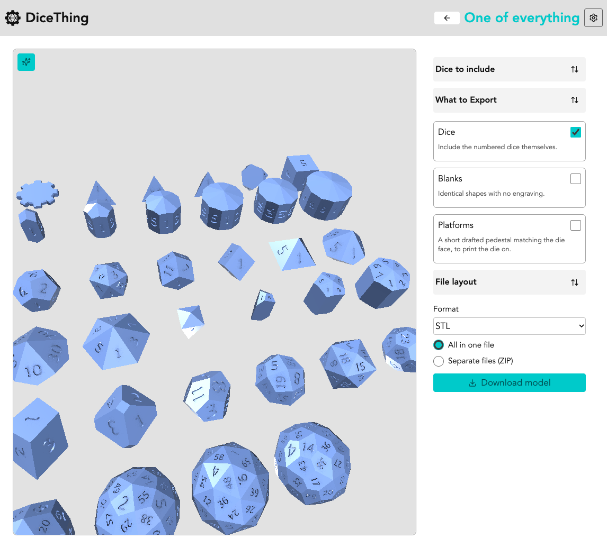

# DiceThing

DiceThing is a tool for creating custom dice models suitable for printing.

My instance at [dicething.org](https://dicething.org)

It is highly inspired by [DiceMaker](https://ankhe.itch.io/dicemaker) which is a fantastic tool, but not open source, so we cannot build on it and make improvements or add features.

Half-way through building this I found [DiceGen](https://dicegen.com/) which is also similar but opinionated in different ways. I haven't looked through the code for that one much (it is open source :heart:) and I think the font-handling is superior. I have spent a lot of time on improving that and the SVG import functionality so hopefully, this project is up to scratch in that regard.

This project also aims to be completely web-based, for a zero-install experience. Web technologies are quite capable of handling the 3D modelling required for this.

## Screenshots

<details><summary>Main Dice Builder</summary>



</details>

<details><summary>Dice Shape Picker</summary>



</details>

<details><summary>Legend Set Editor - Bad Glyphs</summary>



</details>

<details><summary>Legend Set Editor - SVG Import</summary>



</details>

<details><summary>Exporting a Set</summary>



</details>

<details><summary>Whirlwind Tour Video (...soon)</summary>
when I get a chance...
</details>

## Features

- Many dice shapes available, and customisable
- Custom legends
  - Can be created from fonts, or SVGs
- A few font based legends included (fonts all free for commercial use)
- Legend placement on faces (scale/rotate/position/engraving depth)
- Save / Load dice sets
- Save sets in JSON with all data needed to recreate in another browser.
- Export sets or individual dice as STLs
- Blank generation alongside each die
- Platform generation alongside each die

I have some other features in mind that I might add (Z-Stretch compensation, Auto-Supporting, Bumpers), but those will be later.

## Getting Started

This is a SvelteKit project and I use Bun as the runtime but others may work.

Basics:

```
bun install
bun run dev
```

A full static build can be produced with:

```
bun run build
```

## Notes

I originally started this with three.js and a CSG library. But the renders were slow and the resultant STL files were broken in subtle ways.

In the end, I wrote a custom engraving algorithm that works in 2D and then wires up the engravings to form a 3D model. This is much faster and produces better results.

But only visually...

There were still problems with the exported STLs, and I have discovered that this is almost always due to the fonts. The font conversion to paths is not always "clean", and sometimes paths overlap. This doesn't cause a rendering problem on screen, but the meshes get complicated and sometime appear non-manifold. Careful handling of the fonts before legend creation helps.

After much work, the geometry on the engraving still wasn't correct, and I flipped from three.js's earcut `ShapeGeometry` triangulation to `libtess` a more forgiving algorithm that works better with holes and non-convex shapes. This work also helped fix a lot of the font issues I was seeing and font-loading now works on many fonts that it previously failed on.

## Checklist

This was / is my list of features I want to get in. Remarkably most of them got done, or I decided not to do it for a reason.

### Technical

This is the list of the things I have implemented the code for, but not necessarily created the UI for.
The UI section will need a whole lot more...

- [ ] Parameterised Dice Shapes
  - [x] Classic 7 (caltrop d4, cube d6, octahderon d8, trapezohedron d10/d%, dodecahedron d12, icosahedron d20)
  - [x] Crystals (d4, d6, d8, d10/d%, d12)
  - [x] Rhombics (d6, d12)
  - [x] Shards (d4,d6, d8, d10/d%, d12) (theoretically we can do weird ones here, like D3,D5,D7,D9...)
  - [ ] Barrels (d4,d6, d8, d10/d%, d12) (these are the triangle faced ones)
  - [x] Caltrop D4 (as 12 faces both on tips and edges, and with only 4 faces)
    - [x] With 12 faces on tips
    - [x] With 12 faces on edges
    - [x] With 4 faces (for custom stuff)
    - [x] Truncated? i.e. legends on tips?
  - [x] Coin D2 - a short cylinder
    - [x] Regular Polygon
    - [x] Circle ~~(I probably have to keep these separate)~~ (just use 96 segements)
  - [x] Skewed dice
    - [x] Regular polyhedrals can be "skewed" (left or right handed) and remain
          fair. I believe we could add the "skew" as a parameter? rather than
          a completely new style, but actually I think it would be better to have them separate (so "discoverable")
- [x] Legend Engraving
  - [x] auto-fit legends by default
    - [x] auto custom scale per-face-per-legend (i.e. a D20 wants numbers as large as possible on each face, not consistent on each face) - maybe an "oncreate" option?
  - [x] customisable scale/rotation/translation
  - [x] per-face engraving depth
  - [x] per-face legend override
- [ ] position/orient all Die shapes for optimal printing.
- [x] Rendering
  - [x] basic scene render and materials
  - [x] customisable materials for faces/engravings
  - [x] per-face render cache with invalidation
  - [x] offscreen canvas rendering
    - [x] in worker for preview images
    - [-] for main scene (might be more trouble than it's worth at the moment, need to test on slower machines...) - skipping this for now.
  - [x] STL output and geometry preprocessing
  - [x] Bad manifold detection and edge fixing (not 100%, some errors don't cause problems, but it is a warning)
  - [x] multiple dice scene for rendering full sets.
  - [x] mouse pointer integration (for click detection/handling)
- [x] Blanks / Platforms
  - [x] generate a die with blanks at a given "inset" from the source parameters
  - [x] generate platforms automatically from the number faces (custom face shape needed for caltrop)
  - [x] make blank/platform generation configurable.
  - [x] how to make the output accessible to the renderer
  - [ ] Supports? (fins are easiest, but real supports could be done!)
- [x] Save / Load JSON
  - [x] create a serialisation format (JSON, but a schema)
  - [x] save
  - [x] load
  - [x] identify whether use of (say) indexedDB would be a good fit for our data
    - [x] localStorage is fine
- [ ] Legend Creation
  - [x] Load fonts from TTF
  - [x] proprocess font shapes for easily fixable issues
  - [x] create a save/load-able LegendSet from a font and a set of strings to use for each legend
  - [x] find and create legends sets for a few fonts so we have some in-builtin options
  - [x] Add (simple) SVG i.e just paths with fill, not strokes.
  - [x] Add "symbol from font by text" with letter spacing
  - [x] Add "line under symbol" for 6/9 marked symbols - hopefully without breaking the centering?
  - [-] Add "lucide" icons as legends - potrace? or from font lucide is available as a font... (we can certainly import svgs from lucide now, the "pick from font directly though might be a nice feature for UX, i.e. insert icon -> icon picker -> legend)
  - [-] Add custom legend from image. that needs potrace working on a canvas. possibly with some knobs to turn...
    Maybe a disclaimer that for best results provide an SVG pre-converted from "stoke to path" with inkscape instructions.
    In fact maybe ONLY allow that...
    Yeah, I don't think we will allow raster images at all.

### User Interface

This is the final piece that makes all this usable.
I'd like to keep it account-free, and "offline" if possible, but the first step will be "local-first", i.e. whatever data is in your browser.

The first flow will be

1. "new set" button
2. pick dice shapes
3. overview of current dice
4. pick one to edit
5. single die editor
   - live preview
   - all parameters tweakable
   - options for each face
   - single die export (with or without blanks/platforms)
6. back to overview
7. add/remove die shapes
8. save set
9. load new / start new
10. export all as set.

- [x] new set from preset
- [x] load saved set
- [x] import JSON
- [x] set view
  - [x] previews of die
  - [x] main selected die view
  - [x] edit singel die parameters
  - [-] close die parameter draw (for space) (not doing it)
  - [x] save changes!
  - [x] title edit
  - [x] legend editor (component)
    - [x] font loader - character set picker
  - [x] legend picker (component) - i.e. pick a symbol from the current set - a select box alike
  - [x] set menu
    - [x] combine legends/export/lightswitch into a single menu
    - [x] export options (component)
      - [x] toSTL options i.e. auto blanks
      - [x] toJSON ? are there options?

### Fonts

Most issues come from font problems when converted to SVG paths for engraving.

Similar issue when importing SVGs.

There are significant code paths to help reduce this issue, but please let me know if you find any fonts / svgs that should work but don't.

### AI Usage

Some of the code here was produced by LLMs. I actually built the majority before I started using them, which turned out to be a blessing because I learnt so much and feel that the code, build flow and interface design is all exatly how I want it. However, the project stagnated a bit and use LLMs has let me iterate much more quickly and focus on some of the more tricky features (like the SVG imports and font-fixing) that I was stuggling to find the time to work on myself. I doubt I would have go this to such a usable state with them. On the other hand, I would not descibe this project as vibe-coded. I have heavily guided the LLM, not just released it on the codebase.

## Contributing

I started this project because I was unhappy I could not contibute to DiceMaker to add new shapes or features. I want you to be able to add features to this software, so not only is open source and MIT licensed, but it you have worthwhile contributions I'd be happy to accept them. Please reach out / open an issue first however, I may be working on something similar or want to implement the feature myself. If not though, I will say and I will welcome thoughtful PRs. Please keep slop and time-wasting to a minimum, nobody wants that.
